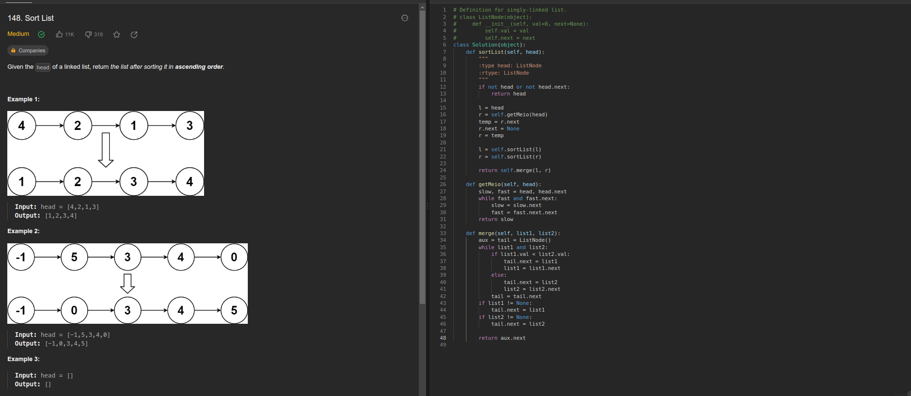
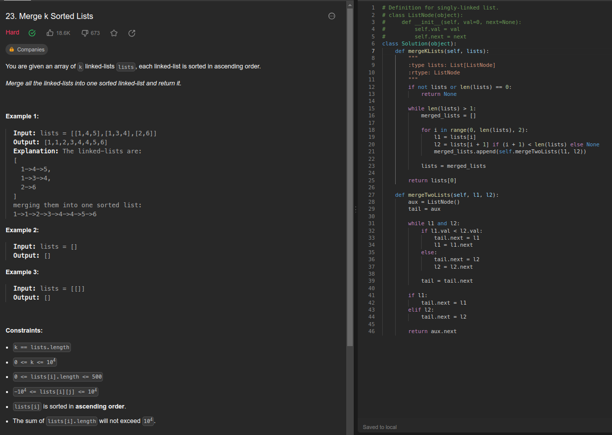
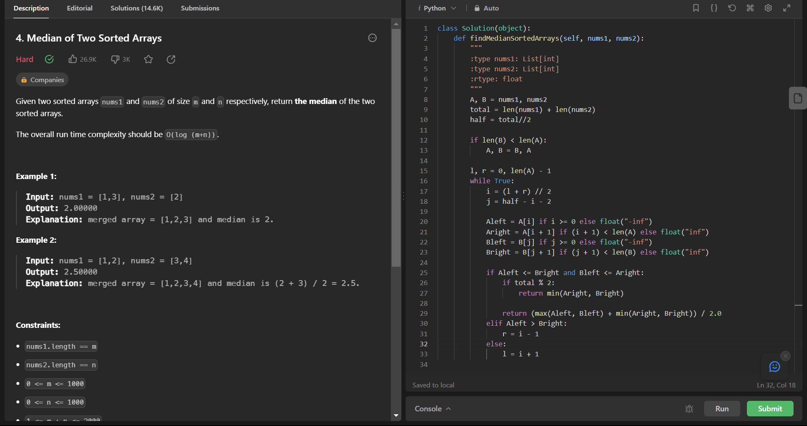

# Dividir-Conquistar_ExerciciosOnline

**Número da Lista**: 4 
**Conteúdo da Disciplina**: Dividir e Conquistar 

## Alunos
|Matrícula | Aluno |
| -- | -- |
| 20/0049020  |  Gabriel Barbosa Alencar |
| 21/1031708  |  Geovane Freitas |

## Sobre 
Este repositório contém a resolução de alguns exercícios do [LeetCode](https://leetcode.com/) relacionados a Dividir e conquistar, comtemplando algoritmos estudados em sala de aula

## [Link da Apresentação]()

## Screenshots

## Exercicio 1 - Sort List

Dificuldade: Médio  
Link: [Sort List](https://leetcode.com/problems/sort-list/)

Este é um exercício consiste na ordenação de uma lista encadeada usando mergesort, algoritmo visto durante as aulas de dividir e conquistar. Compelxidade O (n log n)

## Exercicio 2 - Find the Kth Largest Integer in the Array

Dificuldade: Médio  
Link: [Find the Kth Largest Integer in the Array](https://leetcode.com/problems/find-the-kth-largest-integer-in-the-array/)

Este exercício também utiliza a ideia de dividir o array pra depois achar o maior elemento pelo índice.

## Exercicio 3 - xx
Dificuldade: xx  
Link: 

## Exercicio 4 - xx
Dificuldade: xx  
Link: 

## Instalação 
**Linguagem**: Python 

Caso queira testar localmente é necessário ter o python instalado
## Uso 
Para verificar o funcionamento basta abrir o link do exercicio e copiar o código referente a questão, e logo após realizar o envio. Caso queira verificar localmente, é necessário adicionar a chamada da função principal com seus devidos paramêtros. para rodar basta utilizar o comando:

`python3 NomeDoArquivo.py`
